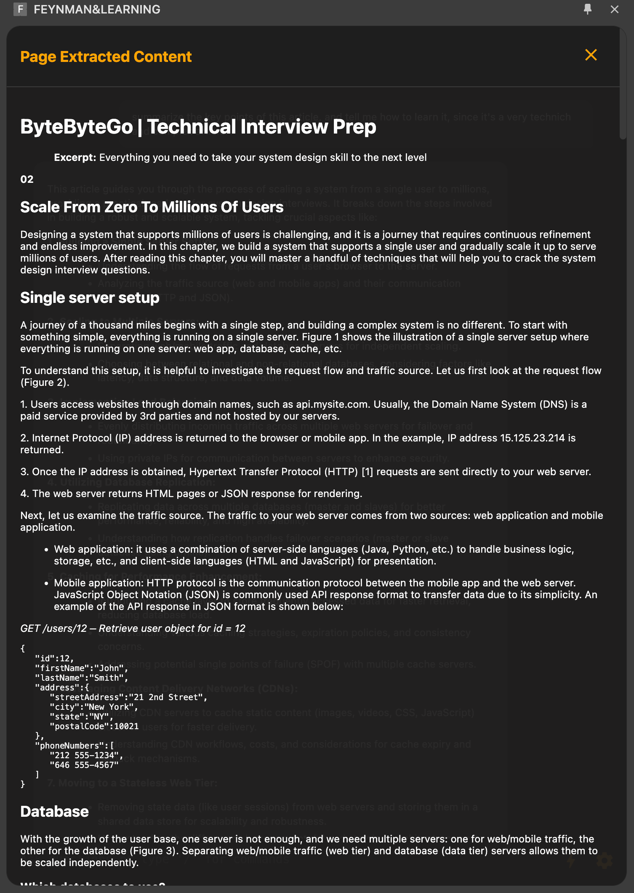
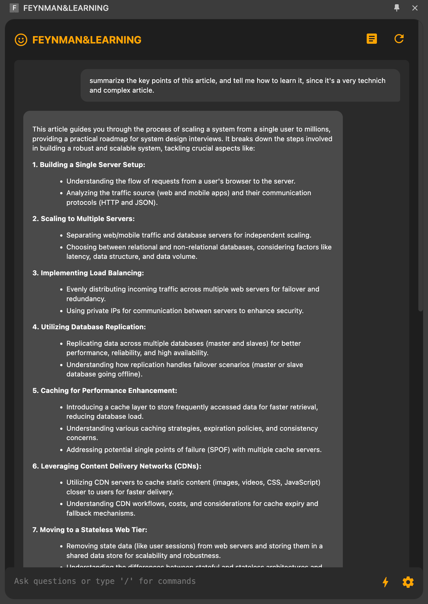

# FEYNMAN&LEARNING - A Chrome Extension for Enhanced Reading

FEYNMAN&LEARNING is a Chrome extension designed to enhance your reading experience by providing an AI-powered reading partner. It extracts the main content from web pages, allows you to interact with an AI assistant, and helps you better understand and engage with the material you're reading.

## Features

- **Content Extraction**: Automatically extracts the main content from web pages, removing clutter and distractions.
- **AI-Powered Conversations**: Engage in conversations about the content you're reading with an advanced AI assistant.
- **Customizable UI**: Dark mode interface with a sleek, user-friendly design.
- **Page Content Panel**: Easily access the extracted content in a separate panel.
- **Markdown Support**: AI responses support markdown formatting for better readability.

## Installation

1. Clone this repository or download the source code.
2. Open Chrome and navigate to `chrome://extensions`.
3. Enable "Developer mode" in the top right corner.
4. Click "Load unpacked" and select the directory containing the extension files.

## Usage

1. Click on the FEYNMAN&LEARNING icon in your Chrome toolbar to open the sidebar.
2. The extension will automatically extract the main content of the current web page.
3. Use the chat input at the bottom to ask questions or interact with the AI assistant.
4. Click the "Page Extracted Content" icon to view the extracted content in a separate panel.

## Configuration

To customize the extension:

1. Click the "Settings" icon in the sidebar.
2. Adjust your preferences, including the AI model and user prompt.
3. Save your changes.

## Development

The extension is built using HTML, CSS, and JavaScript. Key files include:

- `sidebar.html`: Main UI structure
- `sidebar.css`: Styling for the sidebar and content panels
- `sidebar.js`: Core functionality and content management
- `eventHandlers.js`: Event listeners and user interaction handling
- `pageContent.js`: Page content extraction and display logic
- `content.js`: Content script for interacting with web pages

To modify the extension:

1. Make changes to the relevant files.
2. Use a bundler like webpack to compile the JavaScript files.
3. Reload the extension in Chrome to see your changes.

## Contributing

Contributions are welcome! Please feel free to submit a Pull Request.

## License

This project is licensed under the MIT License - see the [LICENSE.md](LICENSE.md) file for details.
